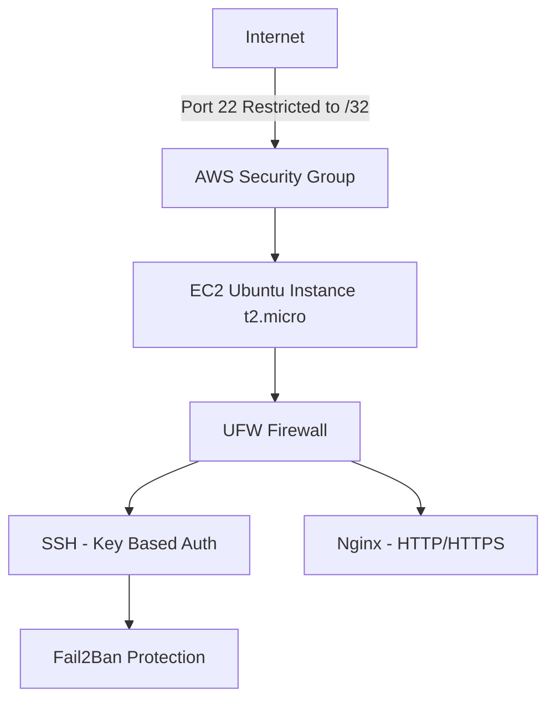
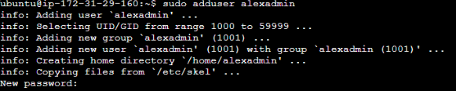
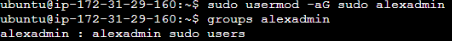
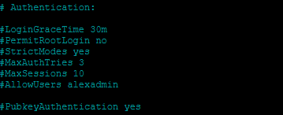

# 🔐 Hardened Ubuntu EC2 Deployment

## 📌 Overview

Deployed and hardened an Ubuntu 22.04 LTS server on AWS EC2 to implement layered security controls including:

- Restricted SSH access
- Non-root administrative access
- Key-based authentication
- OS-level firewall configuration
- Intrusion prevention (Fail2Ban)
- Automatic security updates

This project demonstrates defense-in-depth across cloud and operating system layers.

---

## 🏗 Architecture



---

## ☁️ Cloud Configuration (AWS Layer)

### Security Group Hardening

Inbound Rules Configured:

- SSH (22) → Restricted to single public IP (/32)
- HTTP (80) → Allowed when required
- HTTPS (443) → Allowed when required

Security Rationale:
- Eliminates global SSH exposure (no 0.0.0.0/0)
- Reduces brute-force attack surface
- Enforces perimeter-level access control

---

# 🔐 Operating System Hardening

---

## 1️⃣ System Updates

```bash
sudo apt update
sudo apt upgrade -y
```

Security Impact:
- Applies latest security patches
- Reduces vulnerability exposure

---

## 2️⃣ Admin Account Creation & Privilege Hardening

### Create Non-Root User

```bash
sudo adduser alexadmin
```


### Grant Sudo Privileges

```bash
sudo usermod -aG sudo alexadmin
```

### Verify Group Membership

```bash
groups alexadmin
```
Expected output includes:

```
alexadmin : alexadmin sudo
```


Security Impact:
- Removes reliance on default `ubuntu` user
- Supports least-privilege model
- Prevents direct root access

---

## 3️⃣ SSH Hardening

### Edit SSH Configuration

```bash
sudo nano /etc/ssh/sshd_config
```

Configured the following:

```
PermitRootLogin no
PasswordAuthentication no
PubkeyAuthentication yes
MaxAuthTries 3
LoginGraceTime 30
AllowUsers alexadmin
```


Restart SSH:

```bash
sudo systemctl restart ssh
```

Security Impact:
- Disables root login
- Enforces key-based authentication
- Limits brute-force attempts
- Restricts SSH access to approved user

---

## 4️⃣ Configure SSH Key Access for Admin User

```bash
sudo mkdir -p /home/alexadmin/.ssh
sudo cp ~/.ssh/authorized_keys /home/alexadmin/.ssh/
sudo chown -R alexadmin:alexadmin /home/alexadmin/.ssh
sudo chmod 700 /home/alexadmin/.ssh
sudo chmod 600 /home/alexadmin/.ssh/authorized_keys
```

Security Impact:
- Enforces secure key-based authentication
- Prevents password-based compromise

---

## 5️⃣ UFW Firewall Configuration

### Install UFW (if needed)

```bash
sudo apt install ufw -y
```

### Allow Required Services

```bash
sudo ufw allow OpenSSH
sudo ufw allow 'Nginx Full'
```

### Enable Firewall

```bash
sudo ufw enable
```

### Verify Status

```bash
sudo ufw status verbose
```

Security Impact:
- Implements host-based firewall
- Adds defense-in-depth beyond AWS Security Group

---

## 6️⃣ Install & Configure Fail2Ban

### Install

```bash
sudo apt install fail2ban -y
```

### Create Local Jail Configuration

```bash
sudo cp /etc/fail2ban/jail.conf /etc/fail2ban/jail.local
```

### Edit Jail Config

```bash
sudo nano /etc/fail2ban/jail.local
```

Configured:

```
[sshd]
enabled = true
maxretry = 3
bantime = 600
findtime = 600
```

Restart Fail2Ban:

```bash
sudo systemctl restart fail2ban
```

Verify:

```bash
sudo fail2ban-client status sshd
```

Security Impact:
- Automatically bans repeated failed login attempts
- Mitigates brute-force attacks

---

## 7️⃣ Enable Automatic Security Updates

```bash
sudo apt install unattended-upgrades -y
sudo dpkg-reconfigure --priority=low unattended-upgrades
```

Security Impact:
- Ensures ongoing patch management
- Reduces exposure window for vulnerabilities

---

## 🔎 Validation & Verification

### Check Listening Ports

```bash
sudo ss -tulnp
```

### Check Running Services

```bash
systemctl list-units --type=service --state=running
```

### Check SSH Logs

```bash
sudo journalctl -u ssh
```

---

# 🧠 Security Concepts Demonstrated

- Defense-in-depth (Cloud + OS firewall)
- Least privilege access control
- SSH hardening best practices
- Intrusion prevention mechanisms
- Patch management
- Network boundary enforcement

---

# 🚀 Future Improvements

- Implement HTTPS with Let's Encrypt
- Add CloudWatch monitoring
- Implement centralized logging
- Apply CIS Ubuntu Benchmark checks
- Deploy using Terraform for infrastructure as code

---

# 📌 Summary

This project demonstrates secure Linux server deployment within AWS using layered hardening techniques. The configuration reduces attack surface, enforces strict access control, and introduces intrusion mitigation mechanisms consistent with infrastructure security best practices.
