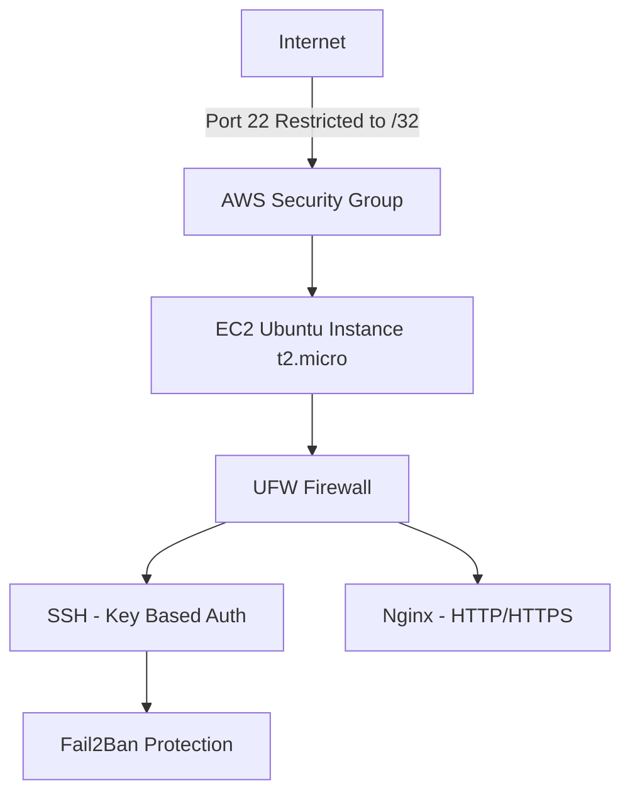
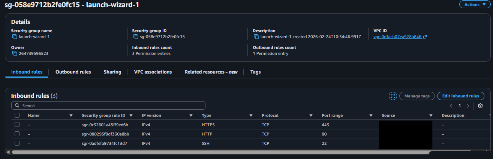
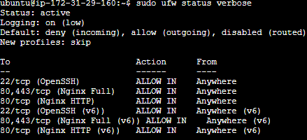
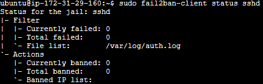

# 🔐 Hardened Ubuntu EC2 Deployment

## 📌 Overview

Deployed and hardened an Ubuntu 22.04 LTS server on AWS EC2 to implement layered security controls including:

- Restricted SSH access
- Non-root administrative access
- Key-based authentication
- OS-level firewall configuration
- Intrusion prevention (Fail2Ban)
- Automatic security updates

This project demonstrates defense-in-depth across cloud and operating system layers.

---

## 🖥 Environment Details

- Cloud Provider: AWS
- Instance Type: t2.micro
- OS: Ubuntu 22.04 LTS
- Region: us-east-1
- Access Method: SSH key-based authentication

---

## 🏗 Architecture


---

Traffic is evaluated in the following order:

1. AWS Security Group (network boundary)
2. UFW host firewall
3. SSH daemon configuration
4. Fail2Ban intrusion mitigation

Each layer enforces independent controls, ensuring no single misconfiguration exposes the system.

---

## ☁️ Cloud Security Group Configuration

### Objective
Restrict network-level access to the EC2 instance before traffic reaches the operating system.

### Inbound Rules Configured

- SSH (Port 22) → Restricted to single public IP (/32)
- HTTP (Port 80) → Allowed only when required
- HTTPS (Port 443) → Allowed only when required

### Security Group Screenshot



Security Impact:
- Eliminates global SSH exposure (no 0.0.0.0/0)
- Enforces perimeter-level access control
- Reduces brute-force attack surface before OS firewall
- Demonstrates cloud-layer defense before host-layer filtering

The instance was deployed in a public subnet but hardened to minimize exposed attack surface.

---

# 🔐 Operating System Hardening

---

## 1️⃣ System Updates

```bash
sudo apt update
sudo apt upgrade -y
```

Security Impact:
- Applies latest security patches
- Reduces vulnerability exposure

---

## 2️⃣ Admin Account Creation & Privilege Hardening

### Create Non-Root User

```bash
sudo adduser alexadmin
```


### Grant Sudo Privileges

```bash
sudo usermod -aG sudo alexadmin
```

### Verify Group Membership

```bash
groups alexadmin
```
Expected output includes:

```
alexadmin : alexadmin sudo
```


Security Impact:
- Removes reliance on default `ubuntu` user
- Supports least-privilege model
- Prevents direct root access

---

## 🔐 SSH Hardening Configuration

### Objective

Harden SSH access to reduce attack surface, enforce key-based authentication, and restrict administrative access to an approved user.

---

### Step 1: Modify SSH Daemon Configuration

Edit the SSH configuration file:

```bash
sudo nano /etc/ssh/sshd_config
```

The following directives were enforced:

```
PermitRootLogin no
PasswordAuthentication no
PubkeyAuthentication yes
MaxAuthTries 3
LoginGraceTime 30
AllowUsers alexadmin
```

---

### Configuration Breakdown

- `PermitRootLogin no`  
  Disables direct root login to prevent privilege abuse.

- `PasswordAuthentication no`  
  Eliminates password-based login to mitigate brute-force and credential stuffing attacks.

- `PubkeyAuthentication yes`  
  Enforces cryptographic key-based authentication.

- `MaxAuthTries 3`  
  Limits repeated authentication attempts per session.

- `LoginGraceTime 30`  
  Reduces the time window for authentication attempts.

- `AllowUsers alexadmin`  
  Restricts SSH access to an explicitly approved administrative account.

---

### Step 2: Restart SSH Service

Apply changes:

```bash
sudo systemctl restart ssh
```

Verify service status:

```bash
sudo systemctl status ssh
```

---

### Security Impact

This configuration:

- Removes root as a remotely accessible attack vector
- Eliminates password-based compromise risk
- Restricts remote access to a single administrative identity
- Reduces brute-force attack exposure
- Enforces least-privilege access principles

Combined with AWS Security Group restrictions and UFW firewall controls, SSH access is now protected at:

1. Cloud perimeter layer (Security Group)
2. Host firewall layer (UFW)
3. Application service layer (SSH daemon configuration)
4. Intrusion detection layer (Fail2Ban)

This demonstrates layered defense (defense-in-depth) for remote administrative access.

## 5️⃣ UFW Firewall Configuration

### Install UFW (if needed)

```bash
sudo apt install ufw -y
```

### Allow Required Services

```bash
sudo ufw allow OpenSSH
sudo ufw allow 'Nginx Full'
```

### Enable Firewall

```bash
sudo ufw enable
```

### Verify Status

```bash
sudo ufw status verbose
```


Security Impact:
- Implements host-based firewall
- Adds defense-in-depth beyond AWS Security Group

---

## 6️⃣ Install & Configure Fail2Ban

### Install

```bash
sudo apt install fail2ban -y
```

### Create Local Jail Configuration

```bash
sudo cp /etc/fail2ban/jail.conf /etc/fail2ban/jail.local
```

### Edit Jail Config

```bash
sudo nano /etc/fail2ban/jail.local
```

Configured:

```
[sshd]
enabled = true
maxretry = 3
bantime = 600
findtime = 600
```

Restart Fail2Ban:

```bash
sudo systemctl restart fail2ban
```

Verify:

```bash
sudo fail2ban-client status sshd
```


Security Impact:
- Automatically bans repeated failed login attempts
- Mitigates brute-force attacks

---

## 7️⃣ Enable Automatic Security Updates

```bash
sudo apt install unattended-upgrades -y
sudo dpkg-reconfigure --priority=low unattended-upgrades
```

Security Impact:
- Ensures ongoing patch management
- Reduces exposure window for vulnerabilities

---

## 🔎 Validation & Verification

### Check Listening Ports

```bash
sudo ss -tulnp
```

### Check Running Services

```bash
systemctl list-units --type=service --state=running
```

### Check SSH Logs

```bash
sudo journalctl -u ssh
```

---

## 🧠 Lessons Learned

- Security Groups are evaluated before host-level firewalls
- Restricting SSH to /32 disables EC2 Instance Connect
- Testing SSH changes in a separate session prevents lockout
- Defense-in-depth requires controls at multiple layers

---

# 🧠 Security Concepts Demonstrated

- Defense-in-depth (Cloud + OS firewall)
- Least privilege access control
- SSH hardening best practices
- Intrusion prevention mechanisms
- Patch management
- Network boundary enforcement

---

# 🚀 Future Improvements

- Implement HTTPS with Let's Encrypt
- Add CloudWatch monitoring
- Implement centralized logging
- Apply CIS Ubuntu Benchmark checks
- Deploy using Terraform for infrastructure as code

---

# 📌 Summary

This project demonstrates secure Linux server deployment within AWS using layered hardening techniques. The configuration reduces attack surface, enforces strict access control, and introduces intrusion mitigation mechanisms consistent with infrastructure security best practices.
