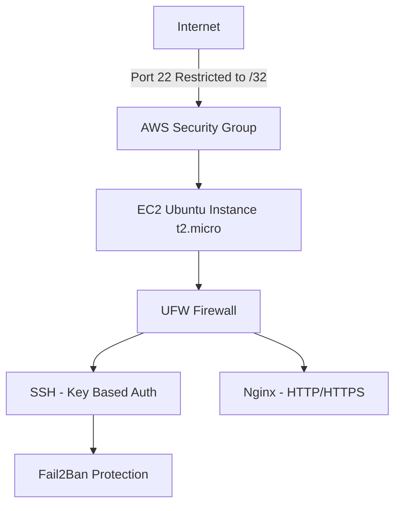

# hardened-ubuntu-ec2
🔐 Hardened Ubuntu EC2 Deployment
📌 Overview

Deployed and hardened an Ubuntu Server instance on AWS EC2 to implement secure SSH access, firewall rules, and intrusion protection mechanisms.

Instance Type: t2.micro
OS: Ubuntu 22.04 LTS
Cloud Provider: AWS

🏗 Architecture

## 🏗 Architecture

🔐 Hardening Steps Performed
1️⃣ User & Privilege Hardening

Created non-root administrative user

Added user to sudo group

Disabled root login via SSH

Restricted SSH access using AllowUsers

PermitRootLogin no
PasswordAuthentication no
AllowUsers alexadmin

Security Rationale:
Reduces brute force attack surface and enforces least privilege.

2️⃣ SSH Hardening

Disabled password authentication

Enforced key-based authentication

Reduced max authentication attempts

Set login grace time

Security Rationale:
Prevents credential stuffing and brute-force attacks.

3️⃣ Network-Level Hardening (AWS Security Group)

Restricted SSH (port 22) to single /32 IP

Opened HTTP/HTTPS only as required

Removed 0.0.0.0/0 SSH access

Security Rationale:
Minimizes external attack surface at perimeter layer.

4️⃣ OS-Level Firewall (UFW)

Enabled UFW

Allowed only required services

Verified listening ports

sudo ufw status verbose
sudo ss -tulnp

Security Rationale:
Implements defense-in-depth beyond cloud firewall.

5️⃣ Intrusion Protection

Installed Fail2Ban

Configured SSH jail

Set max retries to 3

Configured ban time

Security Rationale:
Automatically blocks repeated failed login attempts.

6️⃣ Automatic Security Updates

Enabled unattended-upgrades

Security Rationale:
Ensures ongoing patch management.

🧠 Lessons Learned

Security Groups are evaluated before OS firewalls.

Restricting SSH to /32 disables EC2 Instance Connect.

Proper SSH hardening requires testing in a second session to prevent lockout.

Defense-in-depth means cloud + OS-level protection.

🚀 Future Improvements

Configure HTTPS with Let's Encrypt

Implement CloudWatch monitoring

Add log centralization

Implement CIS benchmark checks
